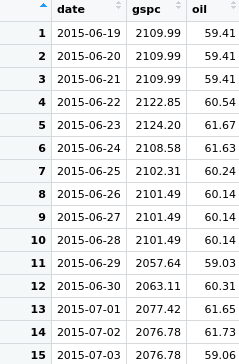
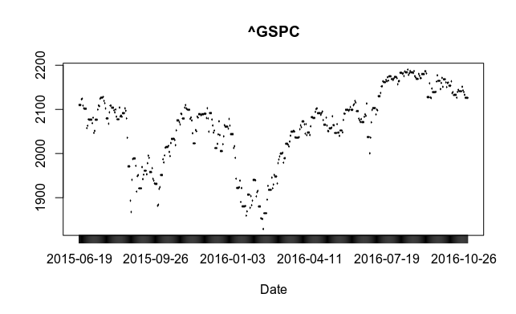
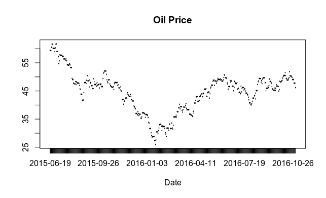
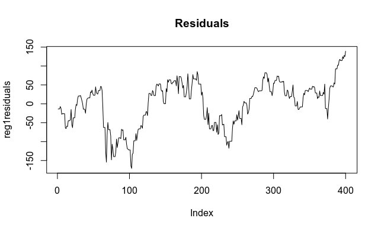
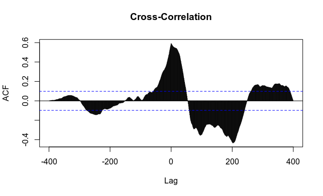
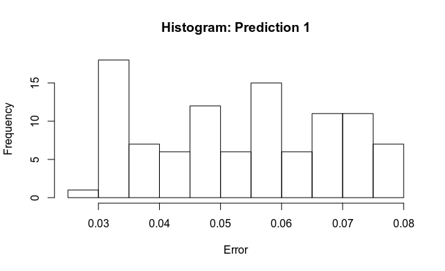
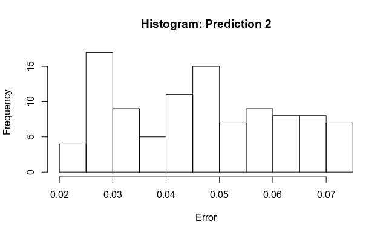
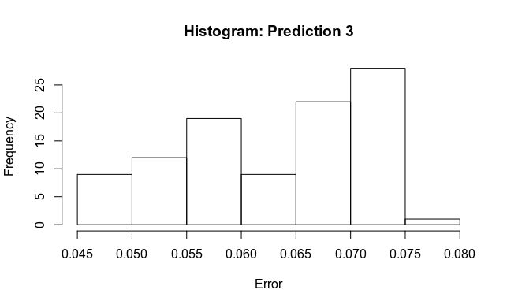
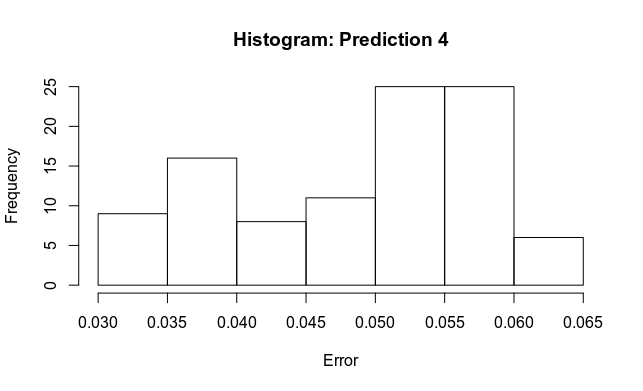

[Home](https://mgcodesandstats.github.io/) |
[Time Series Consulting](https://mgcodesandstats.github.io/time-series-consulting-python-r/) |
[Portfolio](https://mgcodesandstats.github.io/portfolio/) |
[Terms and Conditions](https://mgcodesandstats.github.io/terms/) |
[E-mail me](mailto:contact@michaeljgrogan.com) |
[LinkedIn](https://www.linkedin.com/in/michaeljgrogan/)

# Modelling time series relationships between the S&P 500 and oil prices

In this example, an OLS regression model is constructed in an attempt to forecast future S&P 500 levels based on the price of Brent crude oil.

However, since this OLS regression is incorporating time series data, potential violations such as serial correlation must be legislated for in this instance.

In particular, this analysis will take into account the following considerations when constructing the OLS regression model:

- Use of the Durbin-Watson test to screen for serial correlation
- Remedial measures to remove serial correlation (if present) with the Cochrane-Orcutt remedy
- Stationarity and Cointegration tests
- Cross-Correlation analysis between oil price trends and the S&P 500
- Accuracy of predictions against the test data

## Data

Here is a sample of the dataset (actual timeline is from 19th June 2015 to 31st October 2016):



Here are the plots of the S&P 500 (^GSPC) and oil prices:

**S&P 500**



**Oil**



To start off, the data is split into training and test data, with an OLS regression run on the training data.
```
> # Load data
> setwd("directory")
> mydata<-read.csv("mydata.csv")
> attach(mydata)
> plot(mydata$date,mydata$gspc,type='l',xlab="Date")
> title("^GSPC")
> plot(mydata$date,mydata$oil,type='l',xlab="Date")
> title("Oil Price")

> # Regression 1
> reg1<-lm(gspc~oil,data=train)
> summary(reg1)

Call:
lm(formula = gspc ~ oil, data = train)

Residuals:
    Min      1Q  Median      3Q     Max 
-171.00  -43.55   15.95   42.69  139.25 

Coefficients:
             Estimate Std. Error t value Pr(>|t|)    
(Intercept) 1780.0014    17.6594  100.80   <2e-16 ***
oil            5.7817     0.3951   14.63   <2e-16 ***
---
Signif. codes:  
0 ‘***’ 0.001 ‘**’ 0.01 ‘*’ 0.05 ‘.’ 0.1 ‘ ’ 1

Residual standard error: 60.09 on 398 degrees of freedom
Multiple R-squared:  0.3498,Adjusted R-squared:  0.3482 
F-statistic: 214.2 on 1 and 398 DF,  p-value: < 2.2e-16
```
The regression results are generated as above. However, given that the series in question is a time series, serial correlation must be accounted for.

## Serial Correlation

Serial correlation (also known as autocorrelation) is a violation of the Ordinary Least Squares assumption that all observations of the error term in a dataset are uncorrelated. In a model with serial correlation, the current value of the error term is a function of the one immediately previous to it:
```
et = ρe(t-1) + ut

where e = error term of equation in question; ρ = first-order autocorrelation coefficient; u = classical (not serially correlated error term)
```
This issue is quite endemic in time-series models, given that time series data is hardly ever random and often shows particular patterns and relationships between past and future data.

In this regard, a Durbin-Watson test is applied to test for this condition, while the Cochrane-Orcutt procedure is used to remedy this condition.
```
> # Durbin-Watson Test - Regression 1
> library(lmtest)
> library(tseries)
> library(orcutt)
> dwtest(reg1)

Durbin-Watson test

data:  reg1
DW = 0.072943, p-value < 2.2e-16
alternative hypothesis: true autocorrelation is greater than 0
```
With a p-value of lower than 0.05, the null hypothesis of no serial correlation is rejected and serial correlation is indicated to be present in the model.

In terms of remedial measures, the Cochrane-Orcutt remedy only works when the data is an AR(1) stationary process. In other words, taking a first difference of the data results in a stationary process whereby the data has a constant mean, variance and autocorrelation.

### Consequences of Serial Correlation

According to Studenmund (2010) – a textbook which I find gives a solid introduction to the particulars of serial correlation – the consequences of this condition for a regression model is as follows:

- Ordinary Least Squares is no longer the minimum variance estimator among all linear unbiased estimators.
- Standard errors encounter significant bias in the face of serial correlation, increasing the risk of making a Type 1 or Type 2 error.
- Our coefficient estimates remain unbiased in the face of serial correlation.

### Stationarity and Cointegration

In seeking to test for stationarity, we primarily wish to determine if our series is trend stationary or whether a unit root is present. Trend stationary is where a process is fully stationary once the trend component of the time series is removed. This is not the case in a time series that has a unit root present.

When we refer to a time series as stationary, we mean to say that its mean, variance and autocorrelation are all consistent over time. Cointegration, on the other hand, is when we have two time series that are non-stationary, but a linear combination of them results in a stationary time series. So, why is the concept of stationarity important? Well, a large purpose of time series modelling is to be able to predict future values from current data.

This task becomes much more difficult when mean, variance and autocorrelation parameters do not follow a consistent pattern over time, resulting in an unreliable time series model.

Additionally, this problem is compounded by the fact that time series datasets, by their very nature experience non-stationarity as the presence of factors such as seasonal trends skew the mean and variance. In order to test for stationarity, we use the Dickey-Fuller test. This test works by testing for a unit root in the data where:
```
Δy(t) = δy(t-1) + u(t)
where Δy(t) is the first difference of y and δ=0 represents our unit root
```
Our null and alternative hypotheses are as follows:

- **H0 (Null Hypothesis):** θ = 0 (data is non-stationary and must be differenced to make the data stationary)
- **HA (Alternative Hypothesis):** θ < 0 (data is stationary)

A Dickey-Fuller test is run with **aTSA**.

```
> library(aTSA)

> adf.test(train$gspc)
Augmented Dickey-Fuller Test 
alternative: stationary 
 
Type 1: no drift no trend 
     lag    ADF p.value
[1,]   0 0.1111   0.676
[2,]   1 0.1124   0.676
[3,]   2 0.1300   0.681
[4,]   3 0.0768   0.666
[5,]   4 0.0862   0.669
[6,]   5 0.1353   0.683

Type 2: with drift no trend 
     lag   ADF p.value
[1,]   0 -2.08   0.296
[2,]   1 -2.08   0.295
[3,]   2 -1.93   0.355
[4,]   3 -2.14   0.273
[5,]   4 -2.02   0.319
[6,]   5 -1.93   0.354

Type 3: with drift and trend 
     lag   ADF p.value
[1,]   0 -2.23   0.478
[2,]   1 -2.23   0.478
[3,]   2 -2.09   0.539
[4,]   3 -2.30   0.451
[5,]   4 -2.19   0.496
[6,]   5 -2.09   0.536
---- 
Note: in fact, p.value = 0.01 means p.value <= 0.01 


> adf.test(train$oil)
Augmented Dickey-Fuller Test 
alternative: stationary 
 
Type 1: no drift no trend 
     lag   ADF p.value
[1,]   0 -1.10   0.286
[2,]   1 -1.12   0.278
[3,]   2 -1.13   0.277
[4,]   3 -1.20   0.248
[5,]   4 -1.30   0.216
[6,]   5 -1.25   0.232

Type 2: with drift no trend 
     lag   ADF p.value
[1,]   0 -2.10   0.288
[2,]   1 -2.09   0.292
[3,]   2 -2.10   0.289
[4,]   3 -2.23   0.238
[5,]   4 -2.37   0.181
[6,]   5 -2.43   0.156

Type 3: with drift and trend 
     lag   ADF p.value
[1,]   0 -1.71   0.701
[2,]   1 -1.67   0.716
[3,]   2 -1.67   0.716
[4,]   3 -1.76   0.677
[5,]   4 -1.86   0.636
[6,]   5 -1.98   0.586
---- 
Note: in fact, p.value = 0.01 means p.value <= 0.01 


> adf.test(diff(train$gspc,1))
Augmented Dickey-Fuller Test 
alternative: stationary 
 
Type 1: no drift no trend 
     lag    ADF p.value
[1,]   0 -20.02    0.01
[2,]   1 -15.01    0.01
[3,]   2 -11.26    0.01
[4,]   3 -10.29    0.01
[5,]   4  -9.29    0.01
[6,]   5  -8.73    0.01

Type 2: with drift no trend 
     lag    ADF p.value
[1,]   0 -20.00    0.01
[2,]   1 -15.00    0.01
[3,]   2 -11.25    0.01
[4,]   3 -10.28    0.01
[5,]   4  -9.28    0.01
[6,]   5  -8.73    0.01

Type 3: with drift and trend 
     lag    ADF p.value
[1,]   0 -20.03    0.01
[2,]   1 -15.05    0.01
[3,]   2 -11.31    0.01
[4,]   3 -10.35    0.01
[5,]   4  -9.36    0.01
[6,]   5  -8.81    0.01
---- 
Note: in fact, p.value = 0.01 means p.value <= 0.01


> adf.test(diff(train$oil,1))
Augmented Dickey-Fuller Test 
alternative: stationary 
 
Type 1: no drift no trend 
     lag    ADF p.value
[1,]   0 -20.64    0.01
[2,]   1 -14.37    0.01
[3,]   2 -11.67    0.01
[4,]   3 -10.18    0.01
[5,]   4  -8.29    0.01
[6,]   5  -8.10    0.01

Type 2: with drift no trend 
     lag    ADF p.value
[1,]   0 -20.64    0.01
[2,]   1 -14.38    0.01
[3,]   2 -11.69    0.01
[4,]   3 -10.22    0.01
[5,]   4  -8.33    0.01
[6,]   5  -8.13    0.01

Type 3: with drift and trend 
     lag   ADF p.value
[1,]   0 -20.7    0.01
[2,]   1 -14.5    0.01
[3,]   2 -11.8    0.01
[4,]   3 -10.4    0.01
[5,]   4  -8.5    0.01
[6,]   5  -8.3    0.01
---- 
Note: in fact, p.value = 0.01 means p.value <= 0.01
```
In this instance, we see that the p-value is above 0.05 (non-stationary) before first-differencing, while the first-differenced series shows a p-value below 0.05 (stationary). Thus, the presence of a stationary AR(1) series has been confirmed.

### Cochrane-Orcutt Remedy

Given that the presence of a stationary AR(1) series has been established, the Cochrane-Orcutt method is appropriate to use in this case to remedy serial correlation.

The method works by estimating a ρ value, that is, a correlation value between the residuals and its lagged values, where:
```
yt = yt − p̂yt-1
xt = xt − p̂xt-1
```
The Cochrane-Orcutt estimator in R estimates the appropriate value of p̂ to use in estimating the new regression. The purpose of p̂ is to formulate a regression where the correlations between one error term and the previous are removed so that each observation becomes IID (independent and identically distributed).

In this instance, the Cochrane-Orcutt remedy is applied, and the p-value of the Durbin-Watson statistic rises to 0.7621, indicating that the serial correlation has been eliminated.

```
> reg1residuals=reg1$residuals
> plot(reg1residuals,type='l')
```



```
> title("Residuals")
> orcuttreg1<-cochrane.orcutt(reg1)
> summary(orcuttreg1)

Call:
lm(formula = gspc ~ oil, data = train)

              Estimate Std. Error t value  Pr(>|t|)    
(Intercept) 1767.62816   43.49294  40.642 < 2.2e-16 ***
oil            6.36030    0.79955   7.955 1.891e-14 ***
---
Signif. codes:  
0 ‘***’ 0.001 ‘**’ 0.01 ‘*’ 0.05 ‘.’ 0.1 ‘ ’ 1

Residual standard error: 16.1346 on 397 degrees of freedom
Multiple R-squared:  0.1375 ,  Adjusted R-squared:  0.1353
F-statistic: 63.3 on 1 and 397 DF,  p-value: < 1.891e-14

Durbin-Watson statistic 
(original):    0.07294 , p-value: 7.013e-84
(transformed): 2.07120 , p-value: 7.621e-01

> dwtest(orcuttreg1)

Durbin-Watson test

data:  orcuttreg1
DW = 2.0712, p-value = 0.7621
alternative hypothesis: true autocorrelation is greater than 0
```
## Cointegration Testing: Two-Step Engle Granger Method

On the issue of cointegration, this is present when a linear combination of the non-stationary data transforms the same into a stationary series. This means that the time series show correlation that is statistically significant and not simply due to chance.
However, note that simply using a test such as the adf.test to test the residuals of a linear regression is not appropriate on this case. The reason for this is that the critical values will differ for the adf test since residual based critical values are not the same as that for a standard ADF.
Instead, the coint.test function in R (included with the aTSA library) is used to screen for cointegration.
```
> coint.test(train$gspc,train$oil)
Response: train$gspc 
Input: train$oil 
Number of inputs: 1 
Model: y ~ X + 1 
------------------------------- 
Engle-Granger Cointegration Test 
alternative: cointegrated 

Type 1: no trend 
    lag      EG p.value 
   5.00   -1.99    0.10 
----- 
 Type 2: linear trend 
    lag      EG p.value 
   5.00    1.25    0.10 
----- 
 Type 3: quadratic trend 
    lag      EG p.value 
   5.00   -1.23    0.10 
----------- 
Note: p.value = 0.01 means p.value <= 0.01 
    : p.value = 0.10 means p.value >= 0.10 

> coint.test(train$gspc,train$oil,d=1)
Response: diff(train$gspc,1) 
Input: diff(train$oil,1) 
Number of inputs: 1 
Model: y ~ X - 1 
------------------------------- 
Engle-Granger Cointegration Test 
alternative: cointegrated 

Type 1: no trend 
    lag      EG p.value 
   5.00   -9.73    0.01 
----- 
 Type 2: linear trend 
    lag      EG p.value 
  5.000   0.864   0.100 
----- 
 Type 3: quadratic trend 
    lag      EG p.value 
  5.000  -0.347   0.100 
----------- 
Note: p.value = 0.01 means p.value <= 0.01 
    : p.value = 0.10 means p.value >= 0.10
```
In this case, we see that the p-value is above 0.10 on the data, but stands at 0.01 on the first-differenced data for the Type 1: no trend reading.

Taking this result into account, it is possible that cointegration is present to a certain degree in the model.

## Granger Causality and Cross-Correlation Testing

One must also consider the possibility that any “effects” of the oil price on movements of the S&P 500 may not be instantaneous, and a time lag for the same may be present.

To analyse this further, a cross-correlation plot is generated and a Granger causality test is run.

```
# Cross-Correlation
ccf1<-ccf(train$gspc,train$oil,lag.max=500,main = "Cross-Correlation")
ccf1
```



From the cross-correlation diagram, we see that significant correlations are still present across different time periods:

```
> # Granger Test
> grangertest(train$gspc ~ train$oil, order=119)
Granger causality test

Model 1: train$gspc ~ Lags(train$gspc, 1:119) + Lags(train$oil, 1:119)
Model 2: train$gspc ~ Lags(train$gspc, 1:119)
  Res.Df   Df      F Pr(>F)  
1     42                     
2    161 -119 1.5855 0.0446 *
---
Signif. codes:  
0 ‘***’ 0.001 ‘**’ 0.01 ‘*’ 0.05 ‘.’ 0.1 ‘ ’ 1
> grangertest(train$gspc ~ train$oil, order=120)
Granger causality test

Model 1: train$gspc ~ Lags(train$gspc, 1:120) + Lags(train$oil, 1:120)
Model 2: train$gspc ~ Lags(train$gspc, 1:120)
  Res.Df   Df      F Pr(>F)  
1     39                     
2    159 -120 1.4473 0.0929 .
---
Signif. codes:  
0 ‘***’ 0.001 ‘**’ 0.01 ‘*’ 0.05 ‘.’ 0.1 ‘ ’ 1
```
When attempting to model with Granger Causality, 119 specified lags resulted in a significant p-value at the 5% level. In this regard, a further regression was modelled using this lag order:
```
> # Regression 2
> reg2<-lm(gspc[121:400]~oil[1:280],data=train)
> summary(reg2)

Call:
lm(formula = gspc[121:400] ~ oil[1:280], data = train)

Residuals:
    Min      1Q  Median      3Q     Max 
-195.81  -28.84   15.20   43.88  128.37 

Coefficients:
             Estimate Std. Error t value Pr(>|t|)    
(Intercept) 2148.5554    21.8971  98.121  < 2e-16 ***
oil[1:280]    -2.5630     0.4926  -5.203 3.82e-07 ***
---
Signif. codes:  
0 ‘***’ 0.001 ‘**’ 0.01 ‘*’ 0.05 ‘.’ 0.1 ‘ ’ 1

Residual standard error: 71.81 on 278 degrees of freedom
Multiple R-squared:  0.08873,Adjusted R-squared:  0.08545 
F-statistic: 27.07 on 1 and 278 DF,  p-value: 3.819e-07
```
Again, this regression is tested for serial correlation and corrected using the Cochrane-Orcutt remedy:
```
> dwtest(reg2)

Durbin-Watson test

data:  reg2
DW = 0.050657, p-value < 2.2e-16
alternative hypothesis: true autocorrelation is greater than 0

> orcuttreg2<-cochrane.orcutt(reg2)
> orcuttreg2
Cochrane-orcutt estimation for first order autocorrelation 
 
Call:
lm(formula = gspc[121:400] ~ oil[1:280], data = train)

 number of interaction: 7
 rho 0.981969

Durbin-Watson statistic 
(original):    0.05066 , p-value: 5.973e-61
(transformed): 2.13205 , p-value: 8.657e-01
 
 coefficients: 
(Intercept)  oil[1:280] 
2094.454940   -0.758537
```
Once again, the Durbin-Watson p-value was originally below 0.05, but rose to 0.8657 when corrected with the Cochrane-Orcutt remedy.

## Model Validation

With the constructed regression models, the predictions are now compared against the test data to determine the accuracy of those yielded predictions.
```
> # Predictions
> test1<-mydata[401:500,]
> predict1=1780.0014 + (5.7817*test1$oil) #reg1
> predict2=1767.628 + (6.3602*test1$oil) #orcuttreg1
> predict3=2148.555 -(2.563*train$oil[281:380]) #reg2
> predict4=2094.4549 -(0.7585*train$oil[281:380]) #orcuttreg2


> # Error Readings
> error1=((test1$gspc-predict1)/predict1)
> error2=((test1$gspc-predict2)/predict2)
> error3=((test1$gspc-predict3)/predict3)
> error4=((test1$gspc-predict4)/predict4)


> error1
  [1] 0.06839932 0.06839932 0.06663592 0.06758743 0.06867984 0.07318147
  [7] 0.07835465 0.07835465 0.07835465 0.07881109 0.07247196 0.07444313
......
 [91] 0.03402446 0.03402446 0.03402446 0.04033019 0.03846978 0.03695292
 [97] 0.03342143 0.03411981 0.03411981 0.03411981

> mean(error1)
[1] 0.05358704
> percentage_error1=data.frame(abs(error1))
> accuracy1=data.frame(percentage_error1[percentage_error1$abs.error1. < 0.05,])
> hist(percentage_error1$abs.error1.,main="Histogram: Prediction 1",xlab="Error")
```


```
> error2
  [1] 0.06150638 0.06150638 0.05988886 0.06089057 0.06219623 0.06692979
  [7] 0.07239259 0.07239259 0.07239259 0.07301745 0.06676144 0.06859207
......
 [91] 0.02574522 0.02574522 0.02574522 0.03212685 0.03047106 0.02899229
 [97] 0.02544844 0.02649822 0.02649822 0.02649822

> mean(error2)
[1] 0.04606933

> percentage_error2=data.frame(abs(error2))
> accuracy2=data.frame(percentage_error2[percentage_error2$abs.error2. < 0.05,])
> hist(percentage_error2$abs.error2.,main="Histogram: Prediction 2",xlab="Error")
```


```
> error3
  [1] 0.06082714 0.06082714 0.05763249 0.05797388 0.05462288 0.05631683
  [7] 0.05804001 0.05760459 0.05760459 0.05626166 0.04905807 0.05212281
......
 [91] 0.05792908 0.05533640 0.05533640 0.06034908 0.05416484 0.05395116
 [97] 0.05361024 0.04987011 0.04933896 0.04933896

> mean(error3)
[1] 0.06289291

> percentage_error3=data.frame(abs(error3))
> accuracy3=data.frame(percentage_error3[percentage_error3$abs.error3. < 0.05,])
> hist(percentage_error3$abs.error3.,main="Histogram: Prediction 3",xlab="Error")
```


```
> error4
  [1] 0.05308870 0.05308870 0.04991735 0.05025625 0.04838915 0.05007308
  [7] 0.05178608 0.05165870 0.05165870 0.05032332 0.04349987 0.04670484
......
 [91] 0.04062603 0.03988235 0.03988235 0.04482163 0.04023290 0.03888908
 [97] 0.03659180 0.03323646 0.03308416 0.03308416

> mean(error4)
[1] 0.04888682

> percentage_error4=data.frame(abs(error4))
> accuracy4=data.frame(percentage_error4[percentage_error4$abs.error4. < 0.05,])
> hist(percentage_error4$abs.error4.,main="Histogram: Prediction 4",xlab="Error")
```


The model with the lowest mean percentage error was Regression 2: the regression without any time lags and corrected for serial correlation by the Cochrane-Orcutt remedy.

- Mean Percentage Error of Regression 1: 5.36%
- Mean Percentage Error of Regression 2: 4.61%
- Mean Percentage Error of Regression 3: 6.29%
- Mean Percentage Error of Regression 4: 4.88%

Moreover, of the four regression models, here are the percentage of predictions that came within 5% of the actual value:

- Regression 1: 44%
- Regression 2: 61%
- Regression 3: 9%
- Regression 4: 44%

## Conclusion

To conclude, the original regression model (corrected for serial correlation and without any induced time lags) proved to be the most accurate at forecasting values of the S&P 500 using the oil price. While cross-correlation trends and cointegration were indicated to be present between the time series, there is not enough evidence to conclude that there is a lagged effect between oil price movements and that of the S&P 500.
